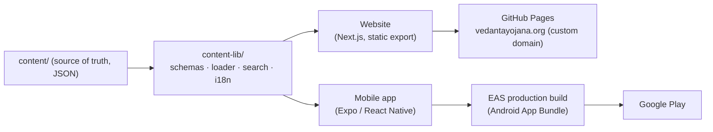
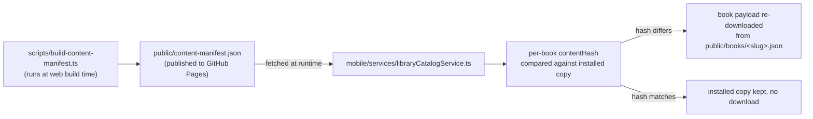

# Development & Architecture

This document explains how Vedanta Yojana is built: its history, its
architecture, and the engineering decisions behind its content, mobile,
and web systems. It is written for contributors, reviewers, and anyone
who wants to understand the project beyond the README.

Every claim below is grounded in the repository's own history and
current configuration. Where a fact comes from Git history, the commit
hash is given. Where it comes from a current file, the file path is
given.

## Contents

- [Project history](#project-history)
- [System architecture](#system-architecture)
- [Content architecture](#content-architecture)
- [Library remote-update architecture](#library-remote-update-architecture)
- [Pasuram offline architecture](#pasuram-offline-architecture)
- [Over-the-air (OTA) updates](#over-the-air-ota-updates)
- [Multilingual system](#multilingual-system)
- [Build architecture](#build-architecture)
- [Testing architecture](#testing-architecture)
- [Deployment architecture](#deployment-architecture)
- [September 18 engineering record](#september-18-engineering-record)
- [September 19 engineering record](#september-19-engineering-record)

## Project history

The repository's Git history runs from **2025-07-27** to the current
release cycle, 272 commits at the time of writing (`git log --oneline
| wc -l`). All content — the Divya Desam records, the books, and the
Knowledge material — is original work by the project's author.

Development of the current architecture — a shared, schema-validated
content model consumed by two independent front ends (Next.js on the
web, Expo on mobile) — began with `6b2c033` ("Phase 6A: establish Expo
mobile architecture and content bridge", 2026-08-12). The "Phase"
numbering visible in commit messages (`6280801` Phase 6C, `e4e7632`
Phase 6E, `cb1aad7` Phase 6E-C) indicates a staged development plan,
though the full phase plan itself is not preserved in the repository
and is therefore not independently verifiable beyond the commits that
exist.

Major milestones, in order:

| Date | Commit | Milestone |
|---|---|---|
| 2026-08-12 | `6b2c033` | Expo mobile architecture and content bridge established |
| 2026-08-12 | `4b5ba48` | Core mobile screens and content rendering |
| 2026-08-13 | `6280801` | Mobile UX refinement (design system, tabs, dark mode) |
| 2026-08-13 | `e4e7632` | Source material integration, mobile content finalized |
| 2026-08-13 | `cb1aad7` | Multi-shrine Divya Desam structure |
| 2026-08-13 – 2026-08-18 | multiple | Full-corpus text-correction audit; Tamil/Kannada/Hindi translation of all 108 Divya Desams |
| 2026-08-16 | `db976f0` | All 108 Divya Desams published |
| 2026-08-17 | `b851f26` | Reading-comfort pass, settings restructure, translation-ready language system |
| 2026-09-15 | `700e417` | Android update notification added |
| 2026-09-17 | `796dcd4`, `9b152a4` | Offline Pasuram downloads, then bundled into the app |
| 2026-09-17 | `24c7e00` | Image zoom viewer |
| 2026-09-18 | `a2b82cf` – `ff4d227` | Security/dependency remediation, content-update architecture, content-accuracy audit, release-engineering hardening — see [September 18 engineering record](#september-18-engineering-record) |
| 2026-09-19 | `7109536` – `c069d11` | Google Play distribution decision, vedantayojana.org custom domain, special-note rendering bug fix, content-accuracy corrections across 10 Divya Desam records — see [September 19 engineering record](#september-19-engineering-record) |
| 2026-09-23 – 2026-09-24 | `2c52bef`, `c0e1fd9` onward | Telugu added as a fifth language (interface, all Divya Desams, all Library chapters), followed by a batch-by-batch fidelity revision (`a455138` – `93c45a0`) |
| 2026-09-23 – 2026-09-24 | `cdcc142`, `2860fda` | EAS Update (OTA) integrated; v16 (1.0.3) built as the production-signed OTA baseline — see [Over-the-air (OTA) updates](#over-the-air-ota-updates) |
| 2026-09-24 | `a6786b1`, `1d52a22` | Telugu Pasurams for all 108 Divya Desams (540 Pasuram PDFs in total); source attribution set to Prapatti.com — both delivered by OTA |

## System architecture

Vedanta Yojana is two independently deployed front ends sharing one
content model:



Neither front end reads `content/` directly. Both go through
`content-lib/`, which validates every record against a Zod schema
before either runtime can render it. This is the mechanism that makes
"content integrity" a checkable property rather than an assumption —
malformed or incomplete content fails validation at build time, not at
read time on a user's device.

**Website** (`app/`, `components/`, `lib/`): Next.js with
`output: "export"`, producing a fully static site with no server
runtime. Deployed to GitHub Pages by `.github/workflows/deploy-pages.yml`.

**Mobile app** (`mobile/`): Expo (React Native), built for Android via
EAS Build. iOS is listed in `mobile/app.json`'s `platforms` but is not
part of this release's distribution.

## Content architecture

```
content/  →  content-lib/ (schemas + loader + search + i18n)  →  app/ (web) or mobile/app/
```

`content/` holds the validated source data:

- 108 Divya Desams
- 4 books, 227 chapters total
- 1 Knowledge record

Every record passes through `content-lib/schemas/` before either
runtime can use it. This is a build-time gate, not a runtime check —
content that fails validation cannot ship.

## Library remote-update architecture

Introduced 2026-09-18 (`4dfc33d feat: automatic content updates for
Library books, no APK required`). This lets an already-installed app
pick up corrected or updated Library book content without a new
Android release, while keeping that mechanism strictly separate from
how the app itself updates. Documented directly in
`content-lib/content-manifest.ts`:



Two deliberately separate manifests exist, each answering a different
question:

| File | Question it answers | Consequence |
|---|---|---|
| `public/app-version.json` | "Is a newer APK/AAB available?" | Never silently installs anything — the user is shown an update prompt and installs manually. |
| `public/content-manifest.json` | "Is newer *content* available for a book the app already knows how to render?" | Can be applied automatically, because it is data an already-installed, schema-compatible app already understands — never code. |

Each manifest entry carries a `contentHash` per book. Format/shape
compatibility is enforced with a `z.literal(...)` schema-version check
(`contentManifestVersion` for the manifest shape,
`BOOK_PAYLOAD_SCHEMA_VERSION` for each book payload's own shape) rather
than a range check: an older installed app whose bundled schema
expects a literal version number will fail closed on a newer manifest
shape — treated identically to "server unreachable" — rather than
attempting to parse a shape it doesn't understand.

## Pasuram offline architecture

Pasurams are bundled *inside* the application, not fetched. As of
`9b152a4` and repackaged in `bafd739` (2026-09-18), all Pasuram PDFs
are shipped as a single Zstandard-compressed archive
(`mobile/assets/pasurams-archive.generated.zst`) rather than as loose
files — a measured (not guessed) size reduction: bundling as one solid
archive brought the relevant portion of the APK down from what 432
loose PDFs would have cost to roughly 52MB total. On first launch, the
app unpacks the archive once into app-private document storage
(`mobile/services/pasuramArchive.ts`); every subsequent open is a plain
local file read with no network dependency and no decompression cost.
Since `a6786b1` (2026-09-24) the archive holds 540 PDFs — Sanskrit,
English, Tamil, Kannada, and Telugu for each of the 108 Divya Desams,
all sourced from Prapatti.com and credited in-app as "Source:
Prapatti.com".

This is why Pasurams work fully offline: they are part of the
installed binary, not remote content. See
[Content Security & Integrity](SECURITY.md#content-integrity) for how
this differs from Library content's update model.

## Over-the-air (OTA) updates

From v16 (versionName 1.0.3, versionCode 16), the Android app receives
JavaScript and bundled-content changes through EAS Update
(`expo-updates`), with no APK reinstall:

- **Configuration** (`mobile/app.json`): runtime version policy
  `appVersion`, so the runtime is `1.0.3`; update URL
  `https://u.expo.dev/fd9baa2d-92be-4e6f-88d4-9c9830516db1`; channel
  `production` (`mobile/eas.json`); the app checks for an update on
  every launch and applies a downloaded update on the next restart.
- **Publishing:** `npm run update` in `mobile/` publishes the current
  commit to the `production` branch. An update reaches only installs
  whose runtime matches, so it must not change native code, and
  `version` in `mobile/app.json` must stay `1.0.3` for v16 installs to
  receive it.
- **Baseline:** v16 is the first OTA-enabled build (EAS build
  `1f5e3c13-39f7-4766-82ba-57712d373153`, production-signed). v15 and
  earlier have OTA disabled and must be upgraded to v16 by installing
  the APK — see [APK-VERIFICATION.md](APK-VERIFICATION.md).
- **Verified:** on a physical device with v16 installed, and without
  reinstalling or clearing data, two production updates were
  downloaded and applied — update group
  `8ec8b1ab-8434-48c3-aa61-b8d838487708` (Telugu Pasurams) and update
  group `82b485ac-741b-4f75-a59f-4efe7bb743d0` (Prapatti.com
  attribution) — and the changed content appeared while the app stayed
  on versionCode 16 / 1.0.3.

## Multilingual system

All 108 Divya Desams exist in Tamil, Kannada, and Hindi in
addition to English (translated in a series of commits from
2026-08-17 to 2026-08-18, culminating in `b851f26`, which also added
the translation-ready language-selection system both runtimes share).
Telugu was added as a fifth language on 2026-09-23 (`2c52bef`), covering
the interface, all Divya Desams, and all Library chapters.
Shared i18n logic lives in `content-lib/i18n.ts`, used by both the
website and the mobile app so language behavior cannot silently
diverge between them.

## Build architecture

**Web:** `npm run build` runs `scripts/build-search-index.ts`,
`scripts/build-book-payloads.ts`, and `scripts/build-content-manifest.ts`
as a `prebuild` step, then `next build` produces the static export.

**Mobile (Android release):**

- Hermes bytecode compilation (`mobile/android/app/build.gradle`,
  `hermesEnabled`) — the JavaScript bundle ships as precompiled Hermes
  bytecode, not readable source.
- R8 minification and resource shrinking are enabled for release builds
  via `expo-build-properties` in `mobile/app.json`
  (`enableProguardInReleaseBuilds`, `enableShrinkResourcesInReleaseBuilds`)
  and applied in `build.gradle` (`minifyEnabled`, `shrinkResources`,
  `proguardFiles`).
- Native build target is `arm64-v8a` only (`buildArchs` in
  `expo-build-properties`).
- Dependency installs are reproducible (`npm ci` in CI, `package-lock.json`
  committed for both the web root and `mobile/`).
- `patch-package` applies two dependency patches at install time (see
  [docs/SECURITY.md](SECURITY.md#dependency-security) for what they fix
  and why).

The Android production build itself runs on **EAS Build** (Expo
Application Services), not on a local machine — see
[Android Build & Release Process](../docs/SECURITY.md#build-security)
and the root [README's Latest Release section](../README.md#latest-release)
for the produced artifact.

## Testing architecture

Three independent suites, run via `npm run ci` (web) and directly via
`node --test` (mobile):

| Suite | Command | Covers |
|---|---|---|
| Content | `npm run test:content` | `content-lib/` schemas, loaders, search, i18n |
| App | `npm run test:app` | Website application layer |
| Mobile | `node --experimental-strip-types --test mobile/tests/*.test.ts` | Mobile services, screens, offline behavior, security regressions |

`.github/workflows/ci.yml` runs content tests, app tests, TypeScript
(`npm run typecheck`), and a production web build on every push and
pull request. `.github/workflows/codeql.yml` runs GitHub CodeQL static
analysis (JavaScript/TypeScript) on every push/PR to `main` and on a
weekly schedule, so newly disclosed vulnerability patterns are checked
against code that hasn't changed.

See [docs/SECURITY.md](SECURITY.md#security-testing) for the specific
security regression test added 2026-09-18.

## Deployment architecture

- **Website:** `.github/workflows/deploy-pages.yml` builds the static
  export and publishes to GitHub Pages on every push to `main`, plus
  manual dispatch. Concurrency is serialized (`cancel-in-progress:
  false`) so an in-flight deploy always finishes before the next one
  starts.
- **Mobile:** production Android builds are produced on demand via
  EAS Build with the production signing credential — the `production`
  profile (AAB) or `production-apk` profile (APK) in `mobile/eas.json`.
  `.github/workflows/build-apk.yml` (`451c600`) also builds an APK when
  an `android-v*` or `v*` tag is pushed, but it signs with the Android
  debug key, so it is not a production release path (it produced the
  debug-signed `android-v14` and `android-v15`). Google Play is the
  planned distribution channel; until then APKs are distributed through
  GitHub Releases — see the root README's
  [Latest Release](../README.md#latest-release) section. JavaScript and
  content changes reach v16 and later installs through
  [OTA updates](#over-the-air-ota-updates). This repository remains the
  source, documentation, and release-provenance record.

## September 18 engineering record

The following is the complete, chronologically ordered set of commits
made on 2026-09-18, the day of the pre-release engineering and content
hardening pass. Times are local commit timestamps.

| Time | Commit | Change |
|---|---|---|
| 12:23 | `a2b82cf` | Patch `decode-uri-component`; pin `postcss`/`uuid` via `overrides` to close Dependabot alerts |
| 12:24 | `bafd739` | Repackage bundled Pasurams as one compressed archive instead of 432 loose PDFs |
| 13:51 | `4dfc33d` | Automatic content updates for Library books, no APK required (see [Library remote-update architecture](#library-remote-update-architecture)) |
| 13:51 | `40d8940` | Transcribe the three Charama Shlokams from their source images |
| 14:02 | `a49e7ae` | Patch `image-size`'s two remaining infinite-loop DoS bugs (see [docs/SECURITY.md](SECURITY.md#the-image-size-vulnerability)) |
| 15:47 | `3db9724` | Suppress a bogus single-entry chapter table of contents |
| 15:53 | `754cfee` | Stop bolding a quoted verse's IAST transliteration as a heading |
| 16:14 | `0f14477` | App-wide formatting audit — consistent bolding, stray markup, punctuation |
| 16:32 | `a9c74df` | Final punctuation sweep — stray spaces and missing list-marker spaces |
| 16:39 | `4d6c7e8` | Fix: downloaded book chapters were in alphabetical, not reading, order |
| 16:56 | `eedc900` | Give special-note markers real callout styling instead of discarding them |
| 17:27 | `0df4000` | Group a special note's own list items into the same callout box |
| 20:37 | `ff4d227` | Persist the `image-size` zero-size-box security regression test |

Two of these are worth calling out specifically for their correctness
impact:

**Chapter ordering (`4d6c7e8`).** Downloaded book chapters were sorted
alphabetically by filename rather than by reading order, silently
mis-ordering navigation for every downloaded Library book. Fixed by
sorting on the chapter's own declared order field instead of filename;
covered by an added regression test in the mobile test suite.

**Special-note handling (`eedc900`, `0df4000`).** Source content
contains editorial "special note" markers that were previously
discarded during rendering rather than displayed. Fixed to render as a
proper callout box, then corrected so a special note's own list items
group into the same callout rather than rendering as a separate,
unstyled list.

This day's work also included the `image-size` dependency security
patch and its regression test — see
[docs/SECURITY.md](SECURITY.md#the-image-size-vulnerability) for the
full technical detail, since that is a security fix rather than a
content fix.

**On content accuracy:** the corrections listed above (formatting,
ordering, transcription, punctuation) demonstrate that stored content
can be validated for *internal consistency* — a chapter's declared
order matches its rendered order, a special note renders as intended,
punctuation is consistent. This is a different property from
*historical or doctrinal accuracy* of the underlying religious texts,
which this engineering process does not and cannot independently
verify. See [Security Limitations](SECURITY.md#security-limitations)
for the explicit distinction.

## September 19 engineering record

**Distribution and infrastructure.** The official Android distribution
channel moved from a direct GitHub Release to Google Play (see
[Signing & release provenance](SECURITY.md#signing--release-provenance)),
and the website moved from GitHub Pages' default project-page URL to
the `vedantayojana.org` custom domain (`public/CNAME`, DNS on
Cloudflare, HTTPS enforced) — the site continues to auto-deploy on
every push to `main`, unchanged. The website favicon now reuses the
mobile app's own icon. Four debug-signed, wrong-package-identity
releases left over from earlier ad-hoc testing (`mobile-v1.0.0` through
`mobile-v1.0.3`, each a `com.anonymous.vedantayojana`-package APK
signed with the Android debug key) were identified in the separate
distribution repo, `vedanta-yojana-releases`, after their signing
certificates were checked directly and confirmed not to match the
project's real production credential.

**Correction (2026-09-19, later same day):** this record previously
stated these four releases had been removed. A subsequent
pre-publication audit found they are still present and still
publicly published (not draft) in `vedanta-yojana-releases`, each with
a nonzero download count — see
[Security limitations](SECURITY.md#security-limitations) and the
Blocking Issues in that audit. They have not been deleted as of this
writing; doing so is a manual GitHub action outside this repository's
own history.

**Special-note rendering bug.** `specialNoteListItemSpan()`
(content-lib/text-format.ts) only absorbed list items immediately
following a special note into its callout box — any other kind of
continuation (plain prose paragraphs, or a note long enough that
`splitIntoReadableParagraphs()` breaks it into several display
paragraphs, both of which lose the note's leading "*" marker after the
first piece) rendered as ordinary, unstyled text right after the box
instead of inside it. Verified against every special note in the
corpus that this is safe to fix by simply absorbing everything
remaining in the note's own paragraph block, since every note is
authored as the sole content of its block. Fixed in the one shared
function used by both platforms' Sthala Puranam, temple-information,
and shrine-detail renderers.

A second, related bug affected notes interrupted by an image whose
`placementAnchor` lands *inside* the note rather than after it: the
image split the note into two segments, and the second one lost its
box entirely (the shared span-fix only sees as far as its own
segment). Fixed by tracking, across both web and mobile's
`SthalaPuranamWithImages.tsx`, whether the note just rendered ran to
its segment's end — if so, the next text segment continues the same
callout without needing its own marker, and without repeating the
"SPECIAL NOTE" label.

**Content corrections** made possible by (and verified against) the
above fix: tirukkudandai, nachiyarkoil, and tirumanimada-kovil's notes
now render in full instead of cutting off mid-sentence;
tirukannangudi's and tiruvaali-tirunagari's existing multi-paragraph
legends are now properly recognized as single notes instead of only
boxing their own title line; tiruvahindrapuram's floating idol caption
is now part of its note, with the idol photo anchored directly to it;
tirukkurugur-azhwar-tirunagari's Nam Āzhwār account (previously split
across four blank-line-separated blocks) is now one continuous note
spanning the Divine Tamarind Tree photo. tiruvelliyangudi's `moolavar`
field had a stray leading `*` — leftover source punctuation, not an
intended note — that wrongly rendered the deity's name itself as a
callout; removed. tirukurungudi's Mahendragiri photo was anchored to
the wrong subheading ("Vaishṇava Nambi Temple" instead of its own);
corrected. Three stray images unconnected to any section were removed
from singavelkundram-ahobilam (a duplicate Nava Narasimha collage and
two unrelated close-ups swept in during the original book-scan
extraction). tiruppavalvannam gained a new second special note (the
Sage Bhṛgu/Nāga Dīpam legend), authored in English and translated into
Tamil, Kannada, and Hindi, IAST-formatted to match the corpus's
existing spelling conventions.

None of this day's fixes changed the underlying religious/historical
content beyond what's described above — see the same content-accuracy
distinction noted for September 18: these are internal-consistency and
rendering corrections, not claims about the corrected text's own
historical accuracy.
